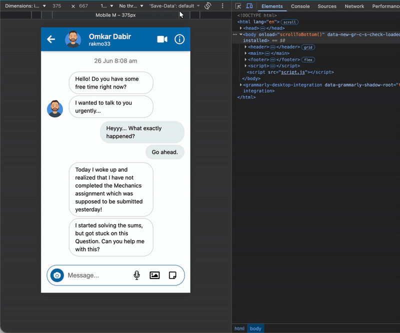
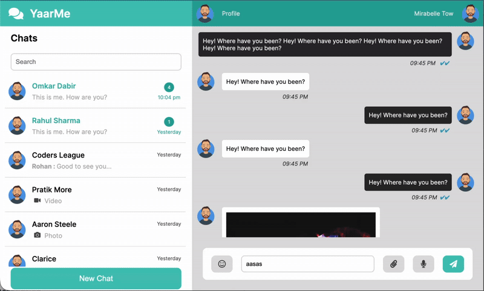

# 🎨 UI Clone Collection

This repository contains a curated set of **mini UI projects** and **screen clones** that I built to practice **responsive, mobile-first design** and interactive UI patterns.  
All **HTML, CSS, and JavaScript** is written from scratch — no frameworks or libraries. Every animation, gesture, and design element is handcrafted.

---

## 📱 Projects Included

### 1. Whatsapp Status (Mobile Only)
- Mobile-only **status screen** with interactive gestures  
- Swipe to next/previous status or next person  
- Fully animated transitions

****  
[Demo Link 🔗](https://rakmo33.github.io/YaarMe-Internship-Tasks/Task-8/index.html
)  
**Demo GIF:**  

---

### 2. LinkedIn/Facebook-like Feed
- Feed with stories, posts, and comments  
- Interactive sidebar that adapts to **mobile view**  
- Navbar converts into **sidebar and bottom navigation** in mobile view  

****  
**Demo Links:**  
- [Demo Link 1 🔗](https://rakmo33.github.io/YaarMe-Internship-Tasks/Task-1/linkedin.html)
- [Demo Link 2 🔗](https://rakmo33.github.io/YaarMe-Internship-Tasks/Task-3/index.html
)
- [Demo Link 3 🔗](https://rakmo33.github.io/YaarMe-Internship-Tasks/Task-9/index.html
)
- [Demo Link 4 🔗](https://rakmo33.github.io/YaarMe-Internship-Tasks/Task-11/index.html
)
- [Demo Link 5 🔗](https://rakmo33.github.io/YaarMe-Internship-Tasks/Task-12/index.html
)

**Demo GIF:**  

---

### 3. LinkedIn Notifications & Network
- Notifications and connections screens  
- Navbar converts into **sidebar and bottom navigation** in mobile view  
- Smooth transitions and responsive layout

****  
[Demo Link 🔗](https://rakmo33.github.io/YaarMe-Internship-Tasks/Task-10/index.html
)  
**Demo GIF:**  

---

### 4. Facebook-like Profile Page
- Desktop and mobile-friendly profile layout  
- Profile image, cover image, info sections, and posts  
- Fully handcrafted responsive styling

****  
[Demo Link 🔗](https://rakmo33.github.io/YaarMe-Internship-Tasks/Task-7/index.html
)  
**Demo GIF:**  

---

### 5. Telegram-like Messaging (Mobile View)
- Mobile-first messaging interface inspired by Telegram  
- Chat list and conversation layout  
- Smooth responsive animations

**Demo Links:**  
- [Demo Link 1 🔗](https://rakmo33.github.io/YaarMe-Internship-Tasks/Task-5/index.html
)
- [Demo Link 2 🔗](https://rakmo33.github.io/YaarMe-Internship-Tasks/Task-6/index.html)

**Demo GIF:**  

---

### 6. Whatsapp Web-like Messaging (Desktop View)
- Desktop messaging layout similar to WhatsApp Web  
- Chat sidebar, conversation pane, and interactive elements  

****  
[Demo Link 🔗](https://rakmo33.github.io/YaarMe-Internship-Tasks/Task-4/index.html
)  
**Demo GIF:**  

---

## 🛠️ Tech Stack
- HTML5 · CSS3 · JavaScript (ES6+)  
- Mobile-first responsive design  
- Flexbox and CSS Grid for layouts  
- Custom animations and transitions  
- No external frameworks or libraries

---

## 🔧 Features
- Fully responsive across **mobile, tablet, and desktop**  
- Interactive gestures and hover effects  
- Animations written entirely by hand  
- Focus on **pixel-perfect UI replication**  
- Practicing **real-world UI patterns and layouts**

---

## 🤝 Acknowledgements
These mini-projects were built **independently** as a learning exercise to sharpen **frontend, responsive design, and animation skills**.
